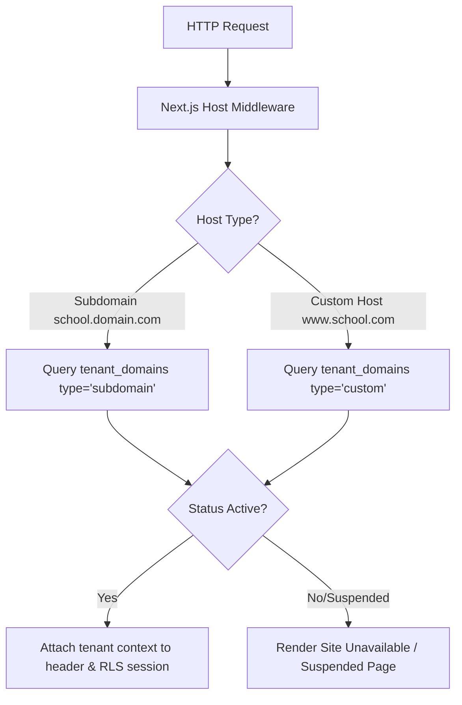

# System Architecture & Multi-Tenancy Specification

## 1. Monorepo Workspaces Layout (`pnpm`)
- `apps/web`: Next.js 15 (App Router, Tailwind CSS, TypeScript strict, `@supabase/ssr`).
- `apps/api`: Cloudflare Worker (Hono framework) for edge logic, PDF generation, webhooks, cron.
- `packages/shared`: Shared types, Zod schemas, constants, feature definitions.
- `supabase/`: Migrations, seed files, and cross-tenant RLS SQL tests.

---

## 2. Multi-Tenant Request Resolution & Middleware

---

## 3. Storage & Payment Provider Abstraction
- **StorageProvider Interface:**
  - `uploadPublic(file, tenant_id, module)`: Uploads compressed WebP image to R2 public bucket.
  - `uploadPrivate(file, tenant_id, module)`: Uploads sensitive document to R2 private bucket.
  - `getSignedUrl(key, expiresSeconds)`: Generates Worker-signed access URL.
  - *Fallback:* Local Mock StorageProvider when R2 credentials are absent.
- **PaymentProvider Interface:**
  - `createOrder(invoice_id, amount, tenant_id)`: Initializes Razorpay Route order.
  - `verifyWebhookSignature(headers, body)`: Validates HMAC webhook signature.
  - `reconcilePayment(payment_id)`: Checks gateway status and marks invoice paid.
  - *Fallback:* Local Mock PaymentProvider with instant test payments.
