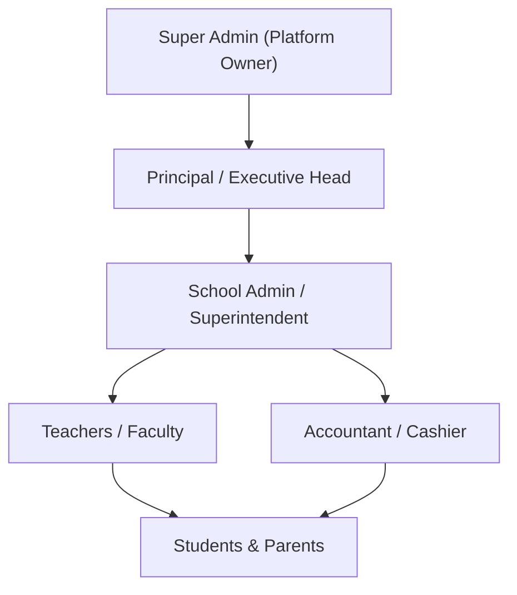
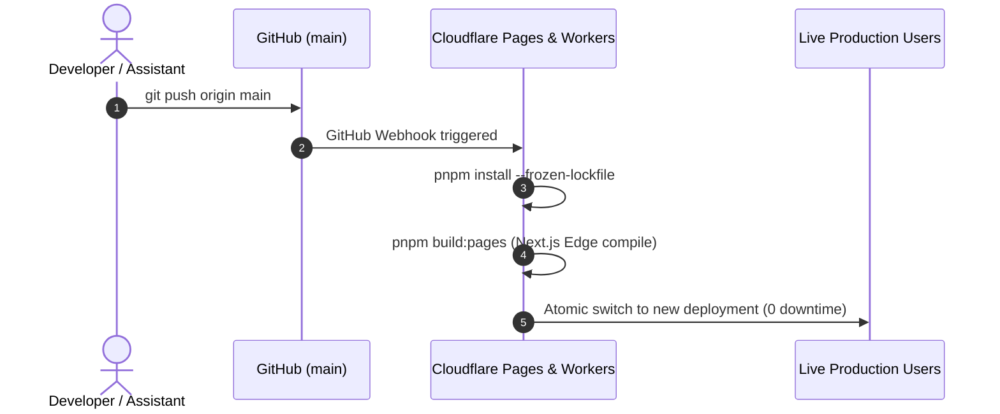

# EduPortal / Institutional Workspace — Master Guidebook & Platform Documentation
> **Version:** 2.0 (Phase 2 Complete)  
> **Repository:** [rindikarenthlei335/institutionalworkspace](https://github.com/rindikarenthlei335/institutionalworkspace)  
> **Live Web App:** [institutionalworkspace.pages.dev](https://institutionalworkspace.pages.dev)  
> **Live API Worker:** [institutionalworkspace.workers.dev](https://institutionalworkspace.workers.dev)  
> **Languages Supported:** English (en) & Mizo (lus)  

---

## Table of Contents
1. [Platform Overview & Executive Summary](#1-platform-overview--executive-summary)
2. [Technology Stack & Architectural Advantages](#2-technology-stack--architectural-advantages)
3. [All Website & Platform Features (Module-by-Module)](#3-all-website--platform-features-module-by-module)
4. [User Roles, Permissions & Daily Responsibilities](#4-user-roles-permissions--daily-responsibilities)
5. [Subscription Tiers, Pricing & Add-on Services](#5-subscription-tiers-pricing--add-on-services)
6. [Payment & Settlement Workflow](#6-payment--settlement-workflow)
7. [System Maintenance, CI/CD & Operations Runbook](#7-system-maintenance-cicd--operations-runbook)
8. [Mizo Tawnga Guide & Hrilhfiahna Tluangtlam](#8-mizo-tawnga-guide--hrilhfiahna-tluangtlam)

---

## 1. Platform Overview & Executive Summary

**EduPortal (Institutional Workspace)** is a production-grade, multi-tenant Software-as-a-Service (SaaS) platform architected specifically for schools, colleges, and educational institutions in Northeast India and beyond. 

The platform unifies:
1. **Public Institutional Websites**: High-speed, SEO-optimized, mobile-responsive school websites with customizable branding and CMS.
2. **School Administration Suite**: Comprehensive student & staff lifecycle, automated fees, biometric attendance, report cards, and PVC ID cards.
3. **Executive Leadership Tools**: A 10-KPI Principal Cockpit and real-time revenue velocity monitors.
4. **Bilingual AI Copilot**: Intelligent AI assistant fluent in English and Mizo with safe draft confirmation and 3,000 quota tracking.
5. **Multi-Tenant SaaS Platform Engine**: Automated tenant provisioning, tier feature gating, custom domains, and platform billing.
6. **Student & Parent PWA Portal**: Verifiable digital ID cards, fee receipts, exam marks, and school notices.

---

## 2. Technology Stack & Architectural Advantages

| Layer | Technology | Key Advantages & Business Value |
|---|---|---|
| **Frontend Framework** | **Next.js 15 (React 19)** App Router | Server Components for 0ms initial load, client-side caching, dynamic edge streaming, and robust SEO. |
| **Styling & Design System** | **Tailwind CSS v4** | Instant compile times, zero runtime overhead, responsive utility tokens, dark mode/custom theme palette. |
| **Hosting & Global CDN** | **Cloudflare Pages** | Globally distributed edge hosting (300+ cities), ultra-low latency (<50ms), automatic SSL/TLS, and 100% uptime. |
| **Edge API & Cron Worker** | **Cloudflare Workers (Hono)** | Serverless microservices running V8 isolates at 0ms cold start for webhook processing, crons, and storage signing. |
| **Database & Auth** | **Supabase (PostgreSQL 15)** | Enterprise relational DB, Row Level Security (RLS) for absolute tenant isolation, connection pooler (port 6543), and realtime subscriptions. |
| **Object Storage** | **Cloudflare R2** | S3-compatible cloud object storage for photos, student documents, and PDFs with **$0 egress fees** (saves ~80% bandwidth cost). |
| **Localization (i18n)** | **Bilingual Engine (en & lus)** | 129 audited translation keys supporting both English and Mizo for inclusive institutional adoption. |
| **Progressive Web App** | **PWA (Service Workers)** | Offline caching, home-screen installability on Android/iOS, and native app experience without store delays. |
| **Payment Gateway** | **Razorpay Route** | Multi-party split settlement directly routing institutional fees to school bank accounts with automated UTR tracking. |

---

## 3. All Website & Platform Features (Module-by-Module)

### A. Public School Website (`/(public)`)
- **Hero Section**: High-resolution campus architecture imagery with emerald brand gradient overlay and glassmorphic quick-action badges.
- **Top Feature Switcher**: Instant role-switching ribbon for admins, principals, and students.
- **About Us (`/about`)**: Institutional vision, mission, history, and leadership address.
- **Faculty & Staff (`/faculty`)**: Teacher directory categorized by department and qualification.
- **Facilities (`/facilities`)**: Smart classrooms, science labs, computer rooms, library, and sports arena showcase.
- **Activities & Sports (`/activities`)**: Co-curricular calendar, sports achievements, and student clubs.
- **Digital Notice Board (`/notices`)**: Categorized notices (Academic, Holiday, Examination, Event) with date stamps.
- **Photo Gallery (`/gallery`)**: High-res photo albums powered by Cloudflare R2 storage.
- **Online Admission Form (`/admission`)**: Multi-step admission registration with document uploads.
- **Quick Fee Pay (`/pay-fee`)**: Parent instant fee checkout via UPI / QR code.

### B. School Administration Suite (`/admin`)
- **Admin Dashboard (`/admin/dashboard`)**: Institutional summary metrics, quick navigation cards, and recent event feeds.
- **Website CMS (`/admin/content`)**: Content management system for notices, faculty profiles, campus facilities, gallery photos, and hero banners.
- **Data Hub (`/admin/data-hub`)**: Master institutional repository with client-side chunked Excel/CSV importer for batch creation of students and staff.
- **Staff & Faculty (`/admin/staff`)**: Full employee management, qualifications, payroll tiers, and website sync.
- **Student Registry (`/admin/students`)**: Student records, roll numbers, guardian contact numbers, blood group, and class sections.
- **Daily Attendance (`/admin/attendance`)**: Class-wise daily attendance marking, monthly attendance registers, and absentee SMS triggers.
- **Exams & Marksheets (`/admin/exams`)**: Term/unit exam scheduling, subject mark entry grid, CBSE/State grade calculation, and verifiable PDF marksheets.
- **PVC ID Card Generator (`/admin/id-cards`)**: Official CR80 PVC ID card studio with photo crop, barcode/QR generation, and batch A4 print sheets.
- **Certificates Hub (`/admin/certificates`)**: One-click Transfer Certificates (TC), Bonafide certificates, and Character deeds with unique verification tokens.
- **Fee Management (`/admin/fees`)**: Day Scholar vs Hosteller fee schedules, payment receipts, fee concessions, and dues tracking.
- **First-Party Analytics (`/admin/analytics`)**: Cookieless, privacy-preserving visitor counters, pageview graphs, and referral trackers.
- **Principal Cockpit (`/admin/principal`)**: Executive leadership cockpit with **10 Real-Time KPIs** (Attendance health, fee velocity, academic pass rate, revenue projection).
- **Custom Website Builder (`/admin/builder`)**: Drag-and-drop visual page section reorderer with live preview.
- **Module Manager (`/admin/modules`)**: Enable, configure, or disable institutional modules with tier entitlement gating.
- **✨ AI Copilot (`/admin/copilot`)**: Four specialized AI modes:
  1. *Guide Mode*: Step-by-step assistance for school administrators.
  2. *Data Mode*: Instant data queries (e.g., "Show me class 10 unpaid fees").
  3. *Action Mode*: Safe draft generation for creating notices, fee reminders, and student updates.
  4. *General Mode*: General educational guidance and communication drafting in English and Mizo.

### C. Super Admin & Platform Engine (`/platform`)
- **Tenants Directory (`/platform/tenants`)**: Multi-tenant manager with active school status, plan tiers, storage usage meters, and audited tenant impersonation.
- **SaaS Plans & Feature Matrix (`/platform/plans`)**: Dynamic feature flag editor to toggle module access per subscription tier.
- **Interactive Tier Selection & Add-on Calculator (`/plans`)**: Public-facing pricing page with Monthly/Yearly toggle, feature matrices, interactive addon checkboxes, and real-time total investment calculator.
- **Custom Domains (`/platform/domains`)**: Custom domain routing (e.g. `school.edu.in`), Cloudflare SSL verification, and CNAME instructions.
- **Platform Billing (`/platform/billing`)**: Aggregate SaaS MRR, ARR, churn rate, and invoice history.

### D. Student & Parent Portal (`/portal`)
- **Portal Dashboard (`/portal/dashboard`)**: Student profile overview, current academic session, and quick action shortcuts.
- **Digital ID Card (`/portal/id-card`)**: Live mobile ID card with scannable QR verification code.
- **Fee Receipts & Dues (`/portal/fees`)**: Digital fee receipts, pending installments, and one-tap payment options.
- **Academic Results (`/portal/results`)**: Downloadable term marksheets with subject breakdown and grade ribbons.
- **School Notices (`/portal/notices`)**: Real-time push notices and circulars.

---

## 4. User Roles, Permissions & Daily Responsibilities



| Role | Access Level | Primary Responsibilities |
|---|---|---|
| **Super Admin** | Platform-Wide (`/platform`) | Tenant provisioning, domain verification, global pricing matrix, infrastructure health, and SaaS billing. |
| **Principal** | Institutional Executive (`/admin/principal`) | Strategic decisions, 10-KPI monitoring, academic performance audits, fee velocity oversight, and staff review. |
| **School Admin** | Full School Operations (`/admin`) | Student admissions, staff directory, website content CMS, ID cards, certificate issuance, and module settings. |
| **Teacher / Faculty** | Academic Module | Student attendance marking, exam marks entry, study material distribution, and class notice posting. |
| **Accountant / Cashier** | Financial Operations | Fee collection, offline receipt generation, UTR reconciliation, dues reporting, and expense auditing. |
| **Student / Parent** | Personal Portal (`/portal`) | Viewing report cards, displaying digital ID cards, paying school fees online, and checking announcements. |

---

## 5. Subscription Tiers, Pricing & Add-on Services

```
+----------------------------------------------------------------------------------------------------+
|                                    SUBSCRIPTION TIER MATRIX                                        |
+------------------------------------+--------------------------------+------------------------------+
| BASIC (₹1,499/mo | ₹14,990/yr)     | ESSENTIAL (₹3,999/mo | ₹39,990)| PRO (₹8,000/mo | ₹79,990/yr) |
+------------------------------------+--------------------------------+------------------------------+
| • School Website (6 Modules)       | • Everything in Basic          | • Everything in Essential    |
| • Theme & Logo Customization       | • Online Fee UPI Payment       | • Principal Cockpit (10 KPIs)|
| • Admin Panel & Notices CMS        | • Student CRUD Management      | • Privacy Website Analytics  |
| • Digital Gallery & Facilities     | • Online Admissions Portal     | • Marksheets & Exams Studio  |
| • Mobile PWA Website               | • Day Scholar / Hostel Fees    | • PVC ID Card Batch Studio   |
| • Subdomain (.eduportal.com)       | • UTR Verification Queue       | • Bank Statement Auto-Match  |
|                                    | • Super Admin + Data Roles     | • AI Copilot (Mizo + English)|
+------------------------------------+--------------------------------+------------------------------+
```

### Interactive Add-On Services (Customizable per School)
| Add-on Service | Monthly Cost | Ideal For |
|---|---|---|
| **SMS & WhatsApp Automated Alerts** | +₹499/mo | Instant fee due reminders, emergency school closing alerts, and attendance notifications. |
| **Daily Attendance & Biometric Sync** | +₹799/mo | Automated RFID gate attendance and biometric thumb scanner integration. |
| **Exam Results & Marksheets Studio** | +₹999/mo | Multi-term grading, CBSE/State report cards, and digital marksheet issuance. |
| **TC / Character & Bonafide Generator** | +₹599/mo | One-click official institutional certificate deeds with online QR verification. |
| **PVC ID Card Batch Studio** | +₹499/mo | High-resolution CR80 plastic card printing with QR codes and photo cropping. |
| **Transport & Bus Tracking Hub** | +₹1,299/mo | School bus routes, stops, vehicle tracking, and monthly transport fee collection. |
| **Cloud Storage Expansion (50 GB)** | +₹299/mo | Cloudflare R2 storage expansion for annual magazines, HD sports photos, and video archives. |
| **Official Institutional Email Pack** | +₹399/mo | 5 professional email addresses (`principal@school.edu.in`) powered by Google Workspace / Zoho. |

---

## 6. Payment & Settlement Workflow

1. **Parent Initiates Payment**: Parent visits `/pay-fee` or logs into `/portal/fees`, selects pending quarter/month, and clicks "Pay with UPI".
2. **Payment Processing**: Razorpay checkout renders UPI QR code, Google Pay, PhonePe, Paytm, or Net Banking.
3. **Split Settlement**: 
   - Platform fee is automatically routed to platform master account.
   - Institutional net amount settles directly into the school’s bank account within T+1 days.
4. **Instant Receipt & Ledger**:
   - Supabase `fee_payments` record updates to status `completed`.
   - Tamper-proof digital receipt PDF with unique transaction hash is generated.
   - Parent receives instant SMS/WhatsApp payment confirmation.

---

## 7. System Maintenance, CI/CD & Operations Runbook

### Automatic Deployment Pipeline (Zero Manual Work)


### Database Operations (Supabase)
- **Migrations Tracking**: All database changes are tracked in `supabase/migrations/` and recorded in `_schema_migrations` table for idempotency.
- **Connection Details**: Supabase Pooler (`aws-0-ap-south-1.pooler.supabase.com:6543/postgres`) handles concurrent queries without exhausting connection pools.
- **Daily Backups**: Supabase performs automatic point-in-time recovery (PITR) backups every 24 hours.

### Storage Operations (Cloudflare R2)
- **Bucket**: `institutionalworkspace`
- **Pre-signed URLs**: All uploads and downloads use time-limited pre-signed S3 URLs generated via `/api/storage/sign-url` for airtight security.
- **Egress Cost**: $0 forever.

---

## 8. Mizo Tawnga Guide & Hrilhfiahna Tluangtlam

### He Platform Hi Eng Nge Ni?
**EduPortal (Institutional Workspace)** hi sikul, college, leh zirna in hrang hrang te tana siam, **All-in-One Cloud Software** a ni. Sikul website satliah mai ni lovin, zirlai leh zirtirtu enkawlna, fee chhutna, attendance, report card siamna, leh ID card siamna zawng zawng huam tel vek a ni.

---

### A Hman Tangkaina Lente (Advantages):
1. **Cloudflare Global Speed**: Khawvel hmun tin atanga tlawh pawhin a rang em em a, server a down ve ngai lo.
2. **Supabase Database Hlauhawm Lo**: Data zawng zawng Cloud PostgreSQL-ah a awm a, bo emaw chhiat palh a hlauhawm lo.
3. **Thlalak Dahna (R2 Storage) A Thlawn**: Thlalak, result, leh certificate duh zat zat upload mah ila download man (egress fee) a awm lo.
4. **Mizo Tawng & Sap Tawng (Bilingual)**: Zirlai leh Nu&Pa ten Mizo tawngin an hrethiam zung zung thei.
5. **Phone & Computer-ah A Thawk**: App anga install theih (PWA) a ni a, Android leh iPhone-ah a mawi em em bawk.

---

### Role Hrang Hrang Te Mawhphurhna:
- **Principal (Head)**: Sikul dinhmun pumpui (10 KPIs), sum lut leh chhuak, zirlai pass rate, leh zirtirtu attendance a en reng ang.
- **School Admin (Clerk/Superintendent)**: Zirlai thar lak luh, ID card print, Certificate (TC) siam, website thuziak thlak, leh fee invoice siam hna a thawk ang.
- **Teacher (Zirtirtu)**: Ni tin student attendance lak leh exam marks chhut luh hna an thawk ang.
- **Accountant (Sum vawngtu)**: Fee lut check, receipt print, leh bank statement auto-match an ti ang.
- **Student & Nu/Pa**: Phone atangin fee pek, report card en, digital ID card neih, leh notice chhiar an ti thei ang.

---

### Tier (Plan) Thlan Dan:
- **BASIC (₹1,499/thla)**: Sikul website mawi tak, Notice board, Gallery, leh Admin CMS chauh duh tan.
- **ESSENTIAL (₹3,999/thla)**: Fee UPI-a pek theihna, Online Admission, leh Zirlai record kimchang enkawl duh tan.
- **PRO (₹8,000/thla)**: Principal Cockpit, Exams & Marksheet siamna, PVC ID Card studio, Website Analytics, leh AI Copilot duh tan.
- **Add-on Checkboxes**: SMS alerts, Biometric attendance, Bus tracking, leh Official email te duh ang zelin a lak belh theih reng bawk e.

---

> **A Tawp Bera Hriattirna:** Code thar emaw siamthat a awm apiangin GitHub-ah automatic-in a in-push a, Cloudflare-in a lo deploy nghal zel dawn avangin engmah buaipui ngai lovin platform hi a nung reng a ni!
