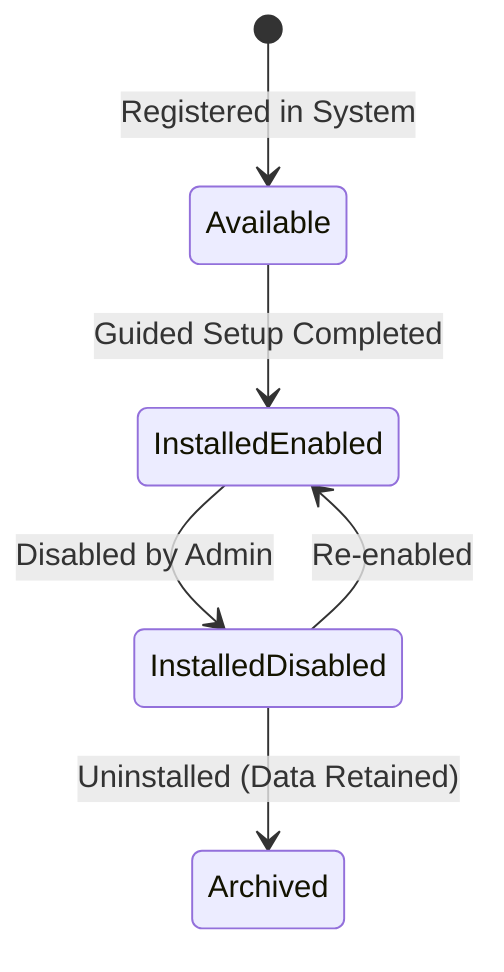

# First-Class Module Architecture & Developer Guide

## 1. Overview
The EduPortal Module Manager architecture allows institutional features (e.g., Attendance, Certificates, Hostel, Transport) to be packaged as first-class, independently installable modules.

Every module is defined by a declarative `ModuleManifest` adhering to `@eduportal/shared` specifications, and its activation state per institution is tracked in the database table `tenant_modules`.

---

## 2. The `ModuleManifest` Standard
Each module provides a `manifest.ts` file implementing `ModuleManifest`:

```typescript
export interface ModuleManifest {
  id: string;                                   // Unique lowercase slug (e.g. 'attendance')
  name: { en: string; lus: string };            // Bilingual module title
  description: { en: string; lus: string };     // Bilingual summary
  icon: string;                                 // Emoji or Lucide icon key
  category: ModuleCategory;                     // 'academics' | 'administration' | 'finance' | 'communication' | 'advanced'
  minPlan: PlanTier;                            // 'basic' | 'essential' | 'pro' | 'ultimate'
  dependencies: string[];                       // Required module IDs (e.g. ['students', 'staff'])
  permissions: UserRole[];                      // Authorized user roles
  routes: string[];                             // Exposed Next.js routes
  navEntries: ModuleNavEntry[];                 // Sidebar links injected when active
  settingsSchema: ModuleSettingField[];         // Configurable parameters
  guidedSetupSteps: GuidedSetupStep[];          // Setup wizard steps
  helpArticles: string[];                       // Markdown help documentation keys
  isCore: boolean;                              // If true, module cannot be disabled (e.g. settings, data_hub)
  version: string;                              // Semantic version string (e.g. '1.0.0')
}
```

---

## 3. Scaffolding a New Module
To create a new module, execute the scaffolding command from the root of the monorepo:

```bash
pnpm gen:module <module_id>
```

### Example:
```bash
pnpm gen:module library
```

This command automatically generates:
1. `apps/web/src/features/library/components/LibraryMasterView.tsx`: Starter view component.
2. `apps/web/src/features/library/manifest.ts`: Manifest declaration.
3. `apps/web/src/app/admin/library/page.tsx`: Admin dashboard page.
4. `content/help/library/index.en.md`: English documentation for help search & AI Copilot.
5. `content/help/library/index.lus.md`: Mizo documentation.

---

## 4. Tenant Lifecycle & State Machine
The module activation lifecycle is tracked in PostgreSQL table `tenant_modules`:



### States:
- `available`: Module is visible in the catalog but not yet configured or active.
- `installed_enabled`: Module is fully active. Its routes are reachable and sidebar links are visible.
- `installed_disabled`: Module is installed but temporarily deactivated. Data remains intact.
- `archived`: Module has been uninstalled. All records are retained for compliance.

> [!IMPORTANT]
> **Core Module Safeguard**:
> Modules flagged with `isCore: true` (`settings`, `data_hub`) **cannot be disabled or uninstalled**. Attempting to disable a core module throws a validation exception.

---

## 5. 6-Step Guided Setup Wizard
When an administrator clicks "Install Module", the Module Manager launches the standard 6-step guided setup:

1. **Overview**: Displays benefits, target users, and estimated configuration time.
2. **Prerequisites Check**: Verifies that the tenant's plan satisfies `minPlan` (e.g. Ultimate tier) and that all prerequisite modules in `dependencies` are enabled.
3. **Configuration**: Renders a dynamic form based on the module's `settingsSchema`.
4. **Roles & Permissions**: Configures role-based access control for faculty, accountants, and operators.
5. **Optional Data Import**: Provides sample Excel templates and batch upload controls.
6. **Review & Confirm**: Commits the record to `tenant_modules` and dynamically refreshes the navigation bar.

---

## 6. Bilingual Support Mandate
In accordance with platform governance, all user-facing strings must support English (`en`) and Mizo (`lus`).
Run the translation verification check before submitting code:

```bash
pnpm i18n:check
```
